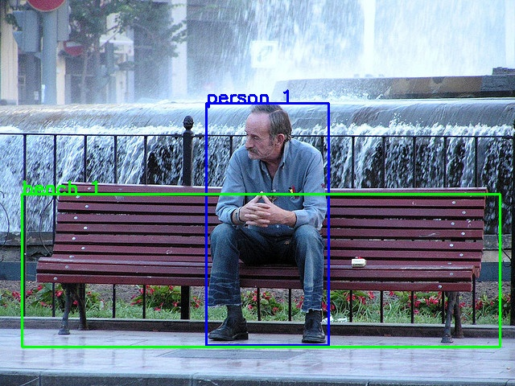
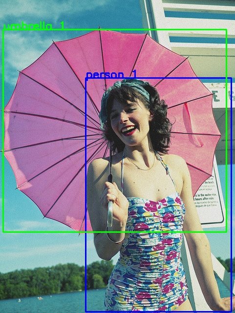
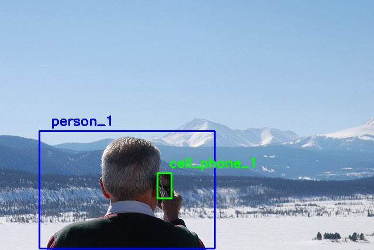

# Scene Labeling
This code base contains the S2T system constructed in CITE PAPER.

This project was created and tested using Python version 3.10. 

This code is free to use but the authors ask that if you make use of any of the code during research you cite the work using PAPER CITATION. 

# Installation 
## Virtual environment
The codebase was created using Python virtual environments. These environments are recommended as they will not install packages directly to your system. A Python virtual environment can be created using the following command from a terminal: 

`python -m venv venv` 

## YOLOv3 Object Detection Model 
The code base uses the YOLOv3 object detection model. Due to size constraints on the repository, the model weights could not be uploaded. The model weights can be downloaded from the [YOLOv3 site](https://pjreddie.com/darknet/yolo/). 

The required file can be directly downloaded from: 
- [yolov3.weights](https://pjreddie.com/media/files/yolov3.weights)

The code base originally stored these files in the `input/models/yolo/` directory alongside the yolov3.cfg file.

## Installing required packages 
The *requirements.txt* file contains the required Python packages in order to perform object detection and scene annotations. To install the required packages, run the following command from the repo root directory in the terminal: 

`pip install -r requirements.txt`

## HoFPy
The Histogram of Forces [[2]](#2) implementation used by this project was supplied by the University of Missouri MINDFUL [[6]](#6) laboratory. 

To install the HOF python package run the following commands from the repo root directory in the terminal: 

`cd HoFPy` 

`pip install .`

# Usage 
The *demo.py* script contains an example usage of the scene annotation system. 

This script runs the scene annotation system on the six images located in the `input/demo_images/` directory.

# Example System Output 
Below are some example outputs generated by the S2T system. Each table contains the localization results on the right 
with the **General** domain annotations and **Person** domain annotations on the right. 

| Object Localization | Level Two Summaries | 
| ------------------- | ------------------- | 
|     | **General:** Person_1 interacting with bench_1   **Person:** Person_1 sitting on bench_1 | 
|  | **General:** Person_1 interacting with umbrella_1   **Person:** Person_1 carrying umbrella_1 | 
| | **General:** Person_1 interacting with cell_phone_1   **Person:** person_1 talking on cell_phone_1 | 

# Attribution
Citation information here 

# References 
<a id="1">[1]</a>
Redmon, J. and Farhadi, A., "YOLOv3: An Incremental Improvement," arXiv, 2018. 

<a id="2">[2]</a>
Matsakis, P. and Wendling, L., “New Way to Represent the Relative Position between Areal Objects,” IEEE Transactions on Pattern Analysis and Machine Intelligence, Vol. 21, No. 7, 1999, pp. 634-643.

<a id="3">[3]</a>
Matsakis, P., Keller, J., Wendling, L., Marjamaa, J. and Sjahputera, O., "Linguistic Description of Relative Positions of Objects in Images", IEEE Transactions on Systems, Man, and Cybernetics, Vol. 31, No. 4, 2001, pp. 573-588.

<a id="4">[4]</a>
Matsakis, P., Keller, J., Sjahputera, O., and Marjamaa, J. “The Use of Force Histograms for Affine-Invariant Relative Position Description”, IEEE Transactions on Pattern Analysis and Machine Intelligence, Vol. 26, No. 1, 2004, pp.1-18.

<a id="5">[5]</a>
Rezatofighi, H., Tsoi, N., Gwak, J., Sadeghian, A., Reid, I., and Savarese, S, "Generalized Intersection Over Union: A Metric and A Loss for Bounding Box Regression", IEEE Conference on Computer Vision and Pattern Recognition (CVPR), June 2019.

<a id="6">[6]</a>
Anderson, D. and Buck, A. "Mizzou Information and Data Fusion Laboratory." Accessed: July 2022. Available: https://github.com/MizzouINDFUL
